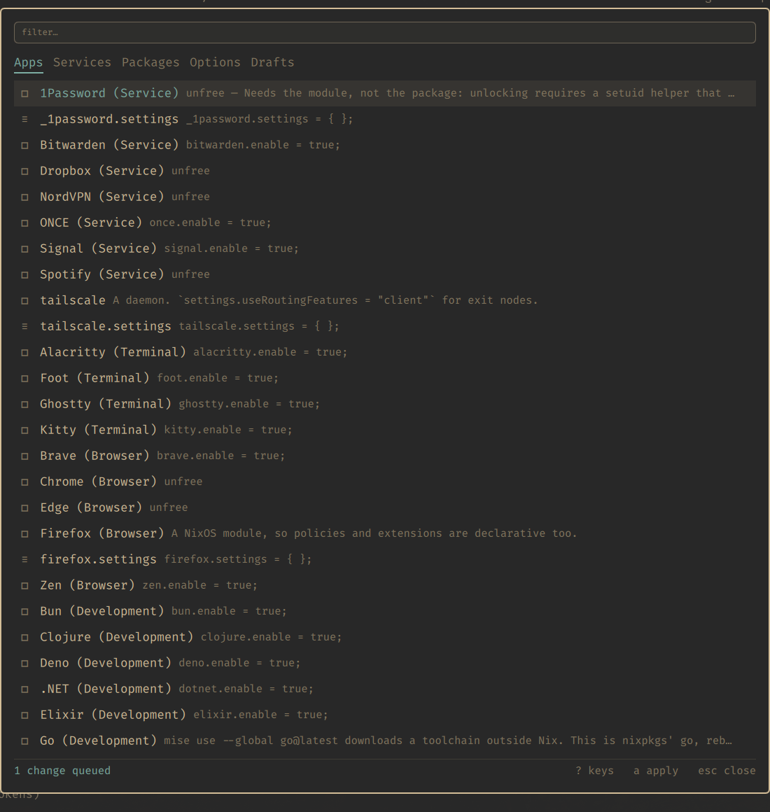

# nixarchy.pkg

Search nixpkgs, turn apps and services on, set NixOS options, and apply —
from the Omarchy shell, on the keyboard.

An [Omarchy](https://omarchy.org) plugin for
[nixarchy](https://github.com/olafkfreund/nixarchy). Installing software on
nixarchy otherwise means a floating terminal and an fzf picker, or editing
`~/.config/nixarchy/apps.nix` by hand and finding the right commented-out
line. Every other surface on the desktop — the menu, herdr, nixi — is a
chord and a list. This makes package management one too.



**[See every surface →](assets/showcase/)** — Apps, Services, nixpkgs search with
unfree and curated flags, the NixOS option forms, the key sheet and the bar
widget, all driven from the keyboard on a real machine.

## What it does

- **Apps and Services** — the curated catalogue by category, with each entry's
  note, showing what is on, off and queued. `SPACE` toggles.
- **Selection** — the packages nixarchy manages, and `/` to search the whole
  nixpkgs index for more, with `unfree` and `broken` flagged
  before anything is queued, and a warning when the curated app list already
  covers a name (the app row gets you the module; the bare package gets you a
  binary).
- **Options** — every NixOS option, with its type, default and documentation,
  and a form built from the declared type.
- **Drafts** — derivations for software nixpkgs does not carry.
- **Queue, then apply.** A toggle edits a file. Nothing is built until you
  press `a`.

`?` shows every key.

## The other channel

`SHIFT+RETURN` on a search result adds it from the channel this machine is
*not* on -- the stable/unstable escape, per package. It is a real decision
rather than a preference: the two channels share no store paths even at the
same version, so a package taken this way brings its own closure.
`nixarchy doctor` reports what that has cost.

The key asks twice. The first press says which channel, and that the
`unfree` and `broken` flags on the row are *not* known for it -- they
describe the package on the channel you are on, which is a different build
of it. The second press adds it.
## Flakes

Software that is not in nixpkgs and ships its own flake -- a Neovim
distribution, a shell framework, a module published on GitHub -- is not a
package to add. It is an input to declare, and declaring one means editing
`flake.nix`.

The **Flakes** tab does that. Type a flakeref, press `RETURN`, and it shows
what the flake exposes before anything is written: `nix flake show` usually
needs no build (a flake using import-from-derivation can make it build; the
adapter gives up after 120 s). Press `RETURN` again on *declare this as an
input* and it asks for the input's name, suggesting the repository's
(`home-manager` for `github:nix-community/home-manager/release-25.05`, never
the branch). `RETURN` takes it, typing replaces it, `ESC` goes back. The line
is then added to your flake and locked; if locking fails, or the flake stops
evaluating, both files are put back exactly as they were.

It stops there, deliberately. It does **not** write the module import,
because which host wants it, whether the module takes arguments and whether
an option must be set to enable it are decisions this cannot make for you.
It shows the line to paste and says plainly that it does not know which file
it belongs in.

Two things it will refuse: a name your flake already uses, because two
definitions of one input is an error. And removing an input while anything
still refers to it, because that breaks evaluation of the whole system
rather than one line. It looks for the name in every `.nix` file of the
flake, as a whole identifier, and errs on the side of refusing: the name in
a string or a comment counts too, and the refusal says which file and line,
so you can take it out by hand if it is only a mention. A removal that goes
through proves the flake still parses, locks and evaluates its metadata; it
does not evaluate every host.

## What it is not

A package manager. Every write goes through a script nixarchy already ships —
`nixarchy-app-enable`, `nixarchy-service-enable`, `nixarchy-pkg-add`,
`nixarchy-opt-remove`, `nixarchy-apply` — which already handle marker
placement, catalogue drift, unfree policy, the stable/unstable channel
escape, backups and the parse check. This plugin is a front-end, and
`bin/nixarchy-pkg` is the whole of its contact with the machine.

It writes to `~/.config/nixarchy/apps.nix` and `services.nix`, and nowhere
else — with one exception, the [Flakes](#flakes) tab, which appends one marked
line to your system flake and locks it. Never the copy of the selection under
the flake.

It lists the same way. The Selection tab shows the packages nixarchy
manages — the marked lines in that file — and not what is installed on
the machine. Packages you declare elsewhere in your own configuration are
neither listed here nor managed here, and removing one here cannot remove
one declared there. That boundary is what makes nixarchy removable: the
selection hangs off a single import, and taking it out leaves nothing
behind.

## The option forms, honestly

Booleans, enums, integers and simple strings get a real widget. Lists,
`null or T`, attribute sets, submodules and functions do not: an option's
value is arbitrary Nix, and a form that pretended otherwise would write
plausible-looking wrong configuration. Those show the option's own example
as a starting shape to edit.

**A field you do not touch writes nothing.** The value shown is the option's
default; leaving it alone keeps the default, because a copied-out default is
a line that reads as a decision and is not one.

**An option already set opens on its value** — the expression written in
`apps.nix`, not whatever NixOS evaluates it to — and writing a different one
changes that line in place. A value the widget cannot hold exactly, such as
`lib.mkDefault true`, opens as its own text. An enum whose alternatives are
not all plain strings or numbers gets the scaffold, with a note saying so,
rather than a list that would be missing some.

## Install

```nix
{
  inputs.nixarchy-pkg.url = "github:olafkfreund/nixarchy-pkg";

  # in your Home Manager configuration:
  programs.nixarchy.plugins.nixarchy-pkg.src =
    inputs.nixarchy-pkg.packages.${pkgs.system}.default;
}
```

Then enable it and bind a key:

```bash
omarchy plugin enable nixarchy.pkg
```

To validate it, validate the build, not the installed folder:

```bash
omarchy plugin validate "$(nix build --print-out-paths github:olafkfreund/nixarchy-pkg)"
```

Home Manager installs the plugin as a symlink into the store, and
`omarchy plugin validate` refuses any symlink by design, so validating the
installed folder fails even though the plugin loads fine
([nixarchy#853](https://github.com/olafkfreund/nixarchy/issues/853)).

Pick a chord that is free on your machine — `omarchy menu keybindings --print`
lists what is taken. `SUPER+SHIFT+N` is a common clash (nvim).

```lua
-- ~/.config/hypr/bindings.lua
o.bind("SUPER + ALT + N", "nixarchy packages",
       "omarchy-shell shell toggle nixarchy.pkg '{}'")
```

Nix installs the plugin; enabling it stays runtime state in `shell.json`,
deliberately.

### In the Omarchy menu

The Hyprland binding appears in `omarchy menu keybindings` on its own, because
`o.bind` carries a description. The menu's *own* keys cannot: they exist only
while the menu holds the keyboard, so Hyprland never sees them.

`share/omarchy-menu.jsonc` has two rows to paste into
`~/.config/omarchy/extensions/omarchy-menu.jsonc` — one under **System**,
beside Lock and Backup and recovery, and one that shows its key sheet under
**Learn**, beside Herdr's. The parent is inferred from the dotted id, so
moving a row elsewhere is a rename and nothing else. Nothing writes that file for you: nixarchy leaves it alone on
purpose, and `nixarchy doctor` fails a run that finds it symlinked or
unwritable.

The keys are listed in `aliases` rather than `description`, so that searching
the Omarchy menu for `apply` or `reindex` finds them. The extension file's own
comment calls `description` "extra search text"; on a running shell it is not
searched, only `label` and `aliases` are.

## Applying

The adapter runs `nixarchy-apply --yes --no-preview`, so there are no
questions to answer, and `nh os switch` elevates itself — and a QML process
has no terminal for a password. It runs with `NH_ELEVATION_STRATEGY=pkexec`,
so the prompt is drawn by Omarchy's own polkit agent, in the same shell the
panel lives in.

The build log streams into the card as it happens, as plain text: the
colour nh prints is stripped, and a progress line shows only its last
state. The last line of the log says how it ended — `applied`, or what
failed.

`ESC` while a build is running stops watching the log. It does not stop the
build: it is elevating, downloading and switching a system, and stopping half
way is never what reaching for `ESC` meant.

## Development

```bash
nix build .#default                     # the plugin, as the shell sees it
omarchy plugin validate ./result
nix flake check                          # shellcheck, manifest, no hex colours
bash tests/adapter.sh                    # the adapter, on a throwaway config
```

`tests/adapter.sh` builds a fresh `XDG_CONFIG_HOME` from
`/etc/nixarchy/*-template.nix` for every case, so a failing test cannot leave
your own selection edited.

Two things that will cost you an afternoon otherwise:

- `omarchy plugin validate` **refuses any symlink inside a plugin folder**,
  so the derivation is `runCommand` + `cp`, never `symlinkJoin` or a wrapped
  binary — and a plugin installed as a symlink for development will not
  validate either.
- Whether `omarchy-shell shell rescanPlugins` reloads changed QML in a plugin
  reached through a symlink has not been verified — discovery does follow
  the link. `omarchy-restart-shell` reliably picks up a change.

## Licence

MIT.
