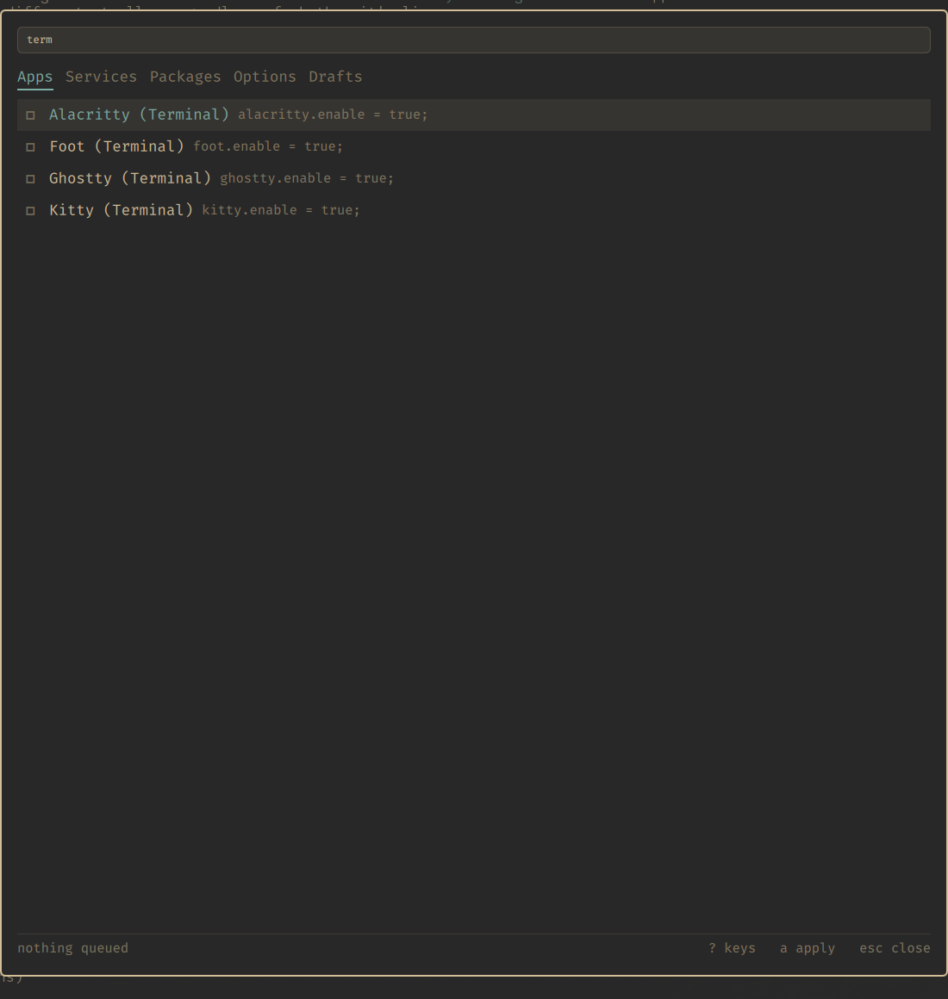
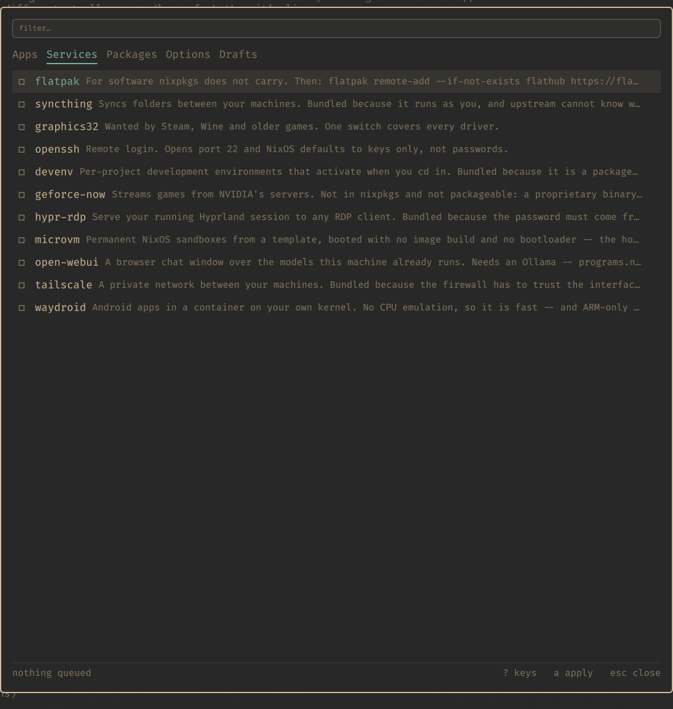
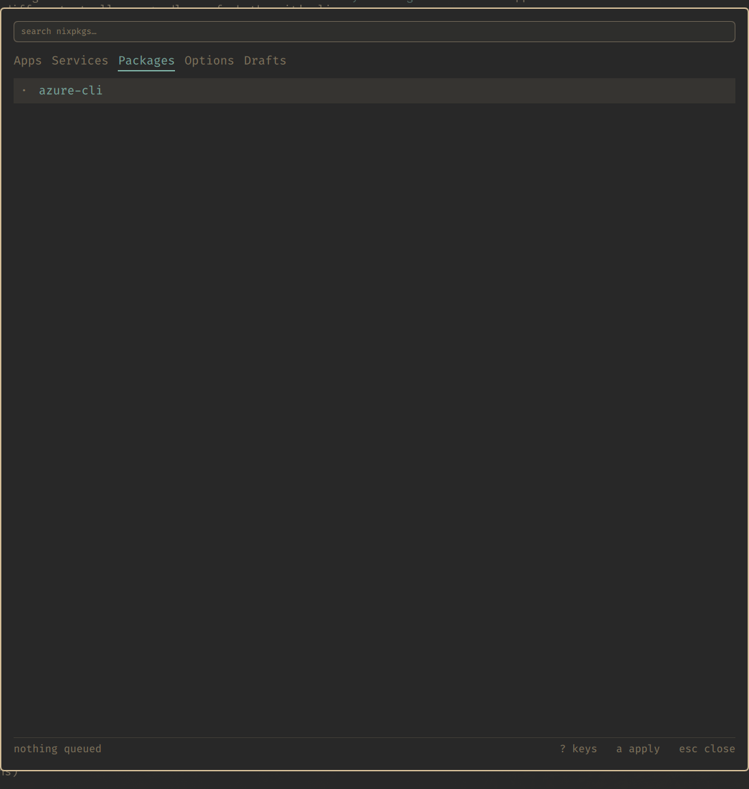
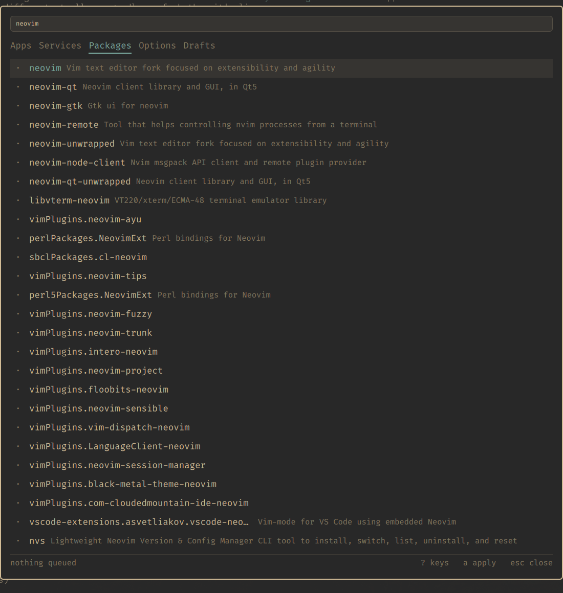
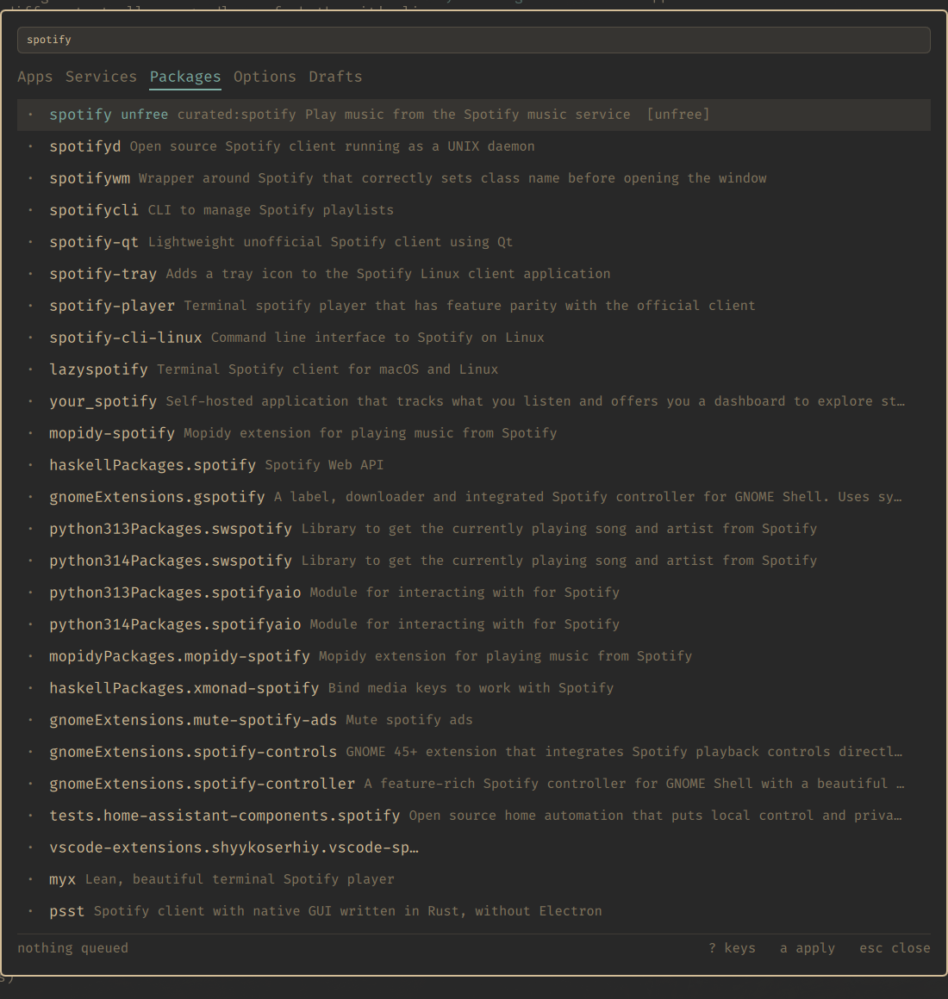
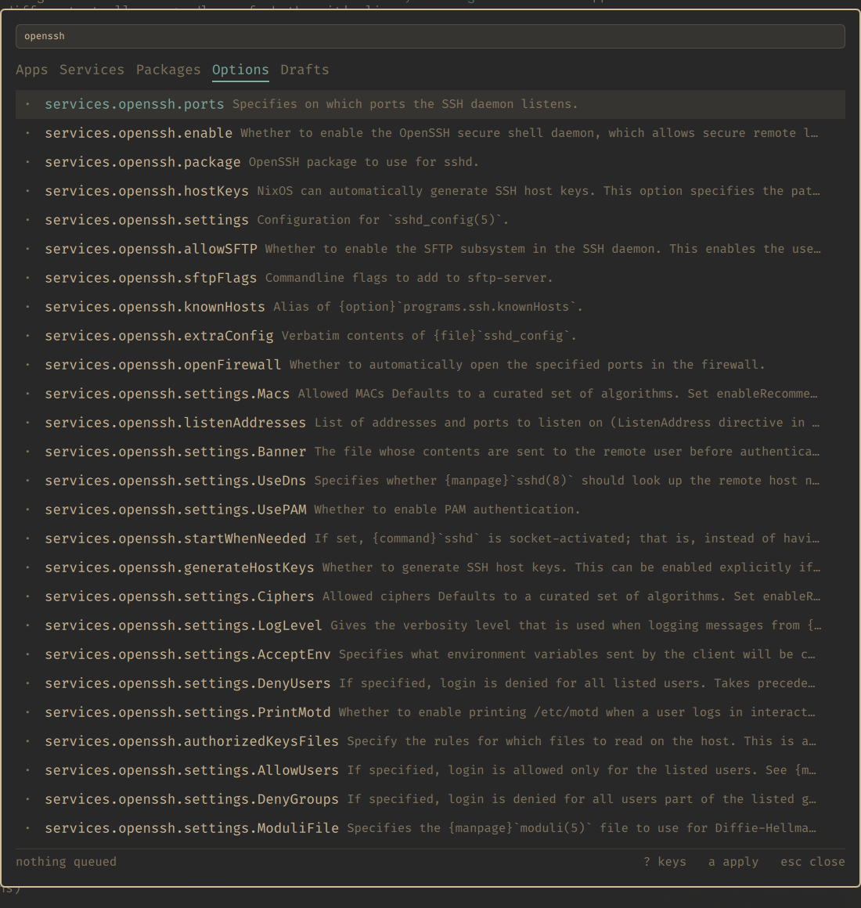
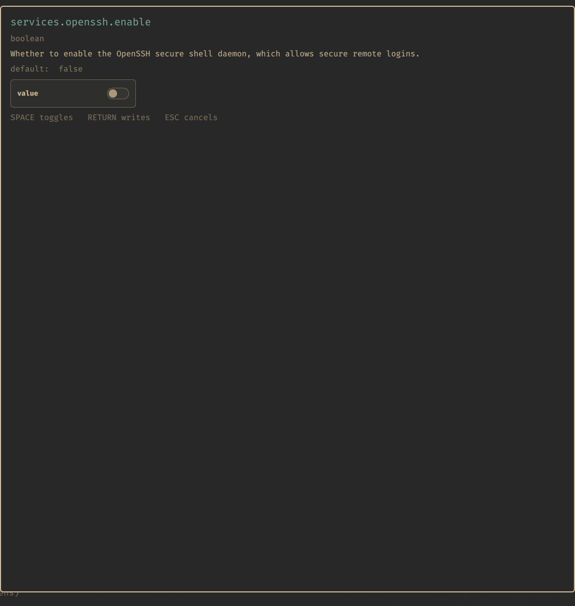
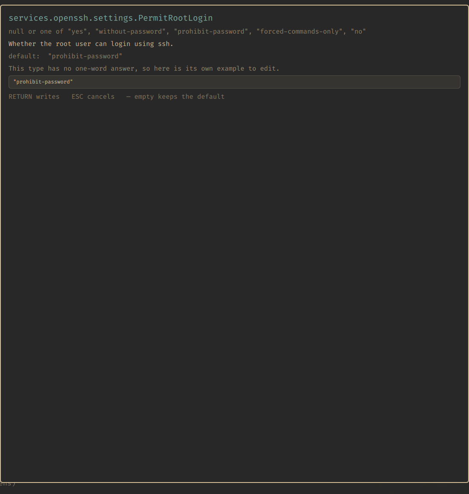
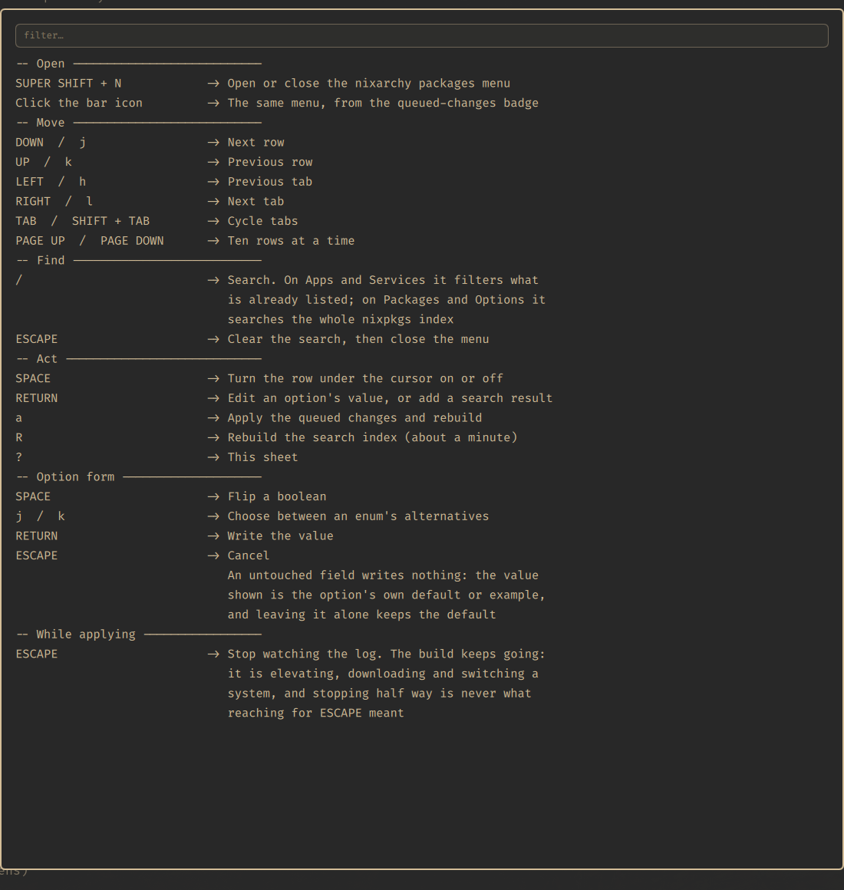
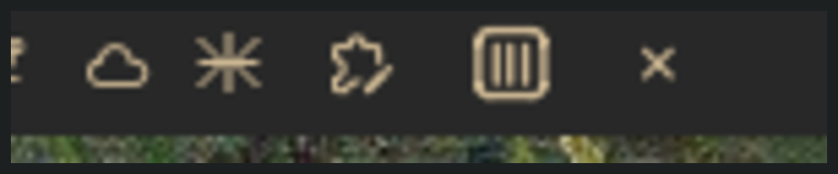

# nixarchy.pkg — a tour

Every shot below is the real plugin on a real machine, driven from the
keyboard. Nothing was installed and nothing was applied: the selection
files were checksummed before and after and are byte-identical.

## Apps

The curated catalogue by category, with each entry's note. `■` is on, `□`
is off, `≡` is a `.settings` attrset — which configures an app rather than
being one, so it has no on/off to offer.

## Filtering

`/` on Apps and Services filters what is already listed, instantly, and
keeps the enabled state a search result would not carry.

## Services

The same, for services. Some are nixarchy bundles, some are the real
upstream option — the line each writes is shown beside it.

## Packages

`/` here searches the whole nixpkgs index instead. The placeholder changes
to say so.

Ranked by where the query landed — exact name, prefix, anywhere in the
name, then the summary — because a plain substring match over 112,547
packages buries the obvious answer.

`unfree` and `broken` are flagged before anything is queued, and
`curated:` warns that the app list already covers a name: the app row gets
you the module, policies and defaults, where the bare package gets you a
binary.

## Options

Every NixOS option — 25,274 of them, including 1,276 `services.*.enable`.
A service that is not in the curated catalogue is just options, and this
is how you reach it.

A boolean gets a real checkbox. The type, the documentation and the
default are read from `options.json`.

A type with no one-word answer gets the option's own example to edit,
instead of a widget pretending it can mean it. **An untouched field writes
nothing** — the value shown is the default, and leaving it alone keeps the
default, because a copied-out default is a line that reads as a decision
and is not one.

## Keys

`?` shows the sheet, read from `bin/nixarchy-pkg-keys` — the same script
the Learn menu uses, so there is one list rather than two that drift.

## In the bar

A snowflake and a count of what is waiting for the next rebuild. A queued
change is otherwise invisible: the file is edited and nothing is built.

