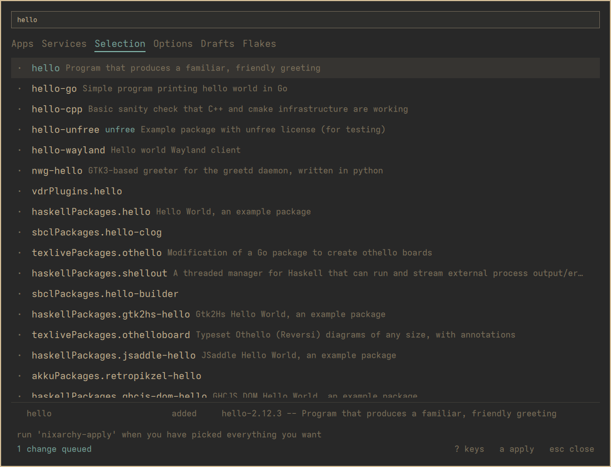
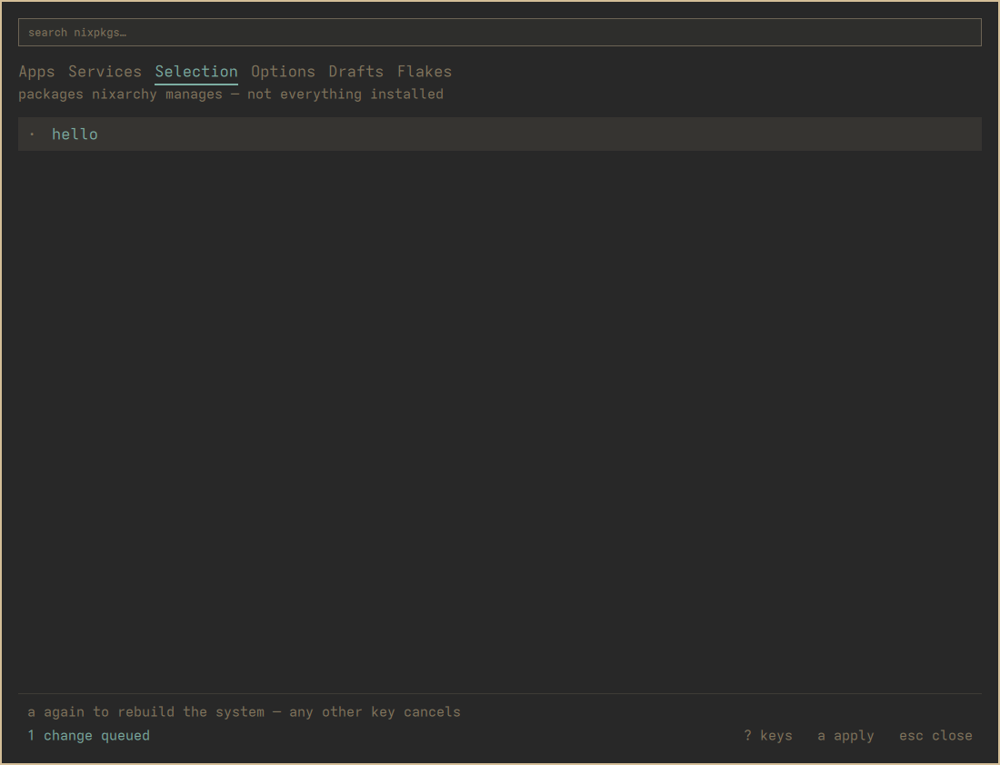
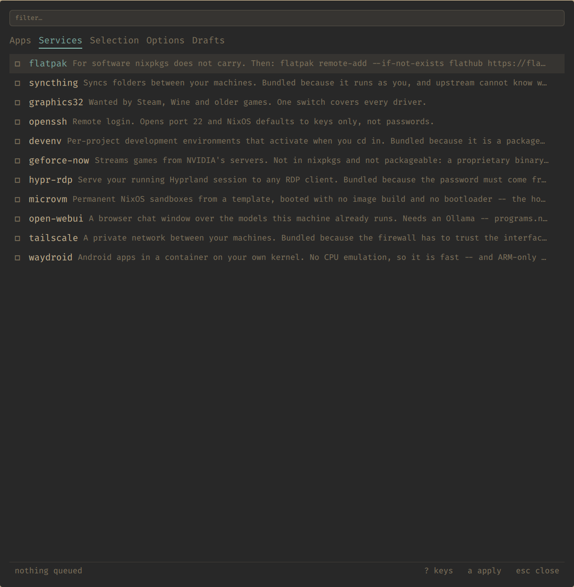
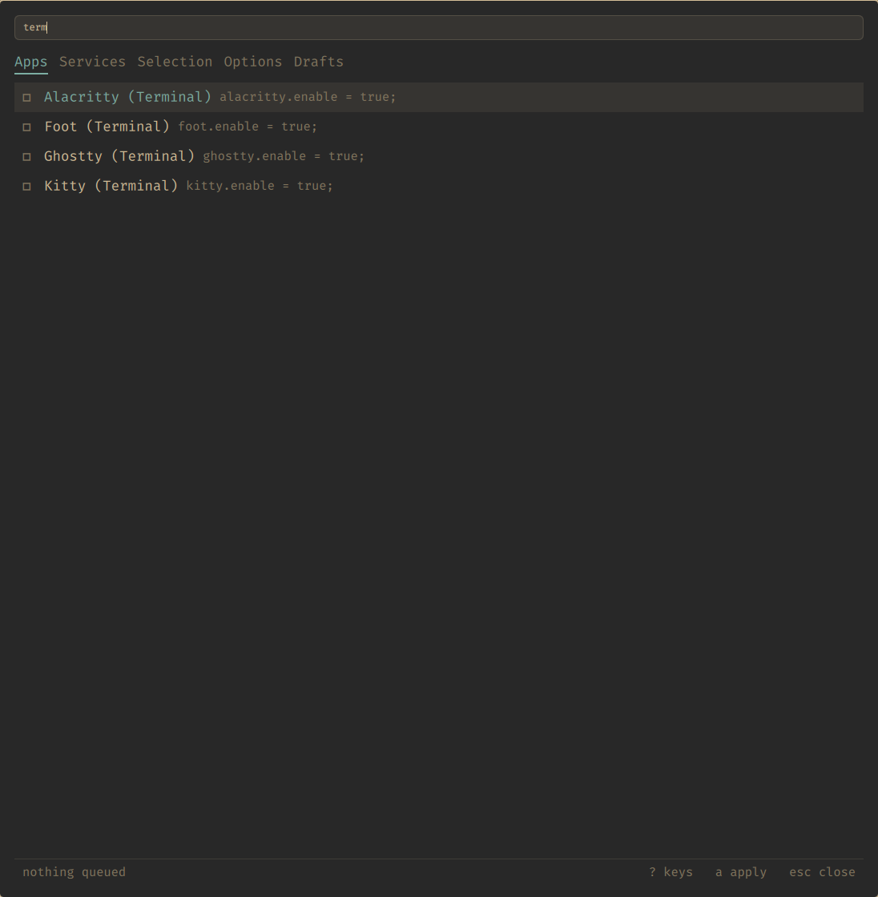
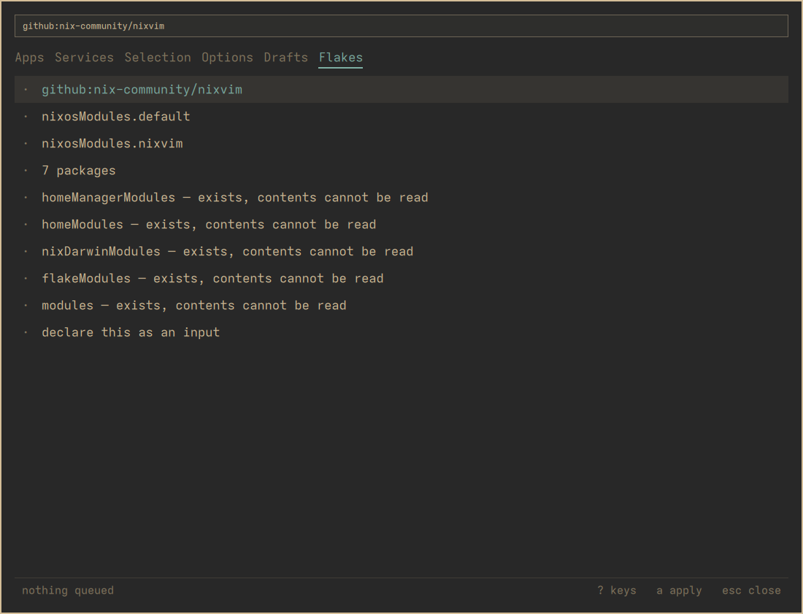
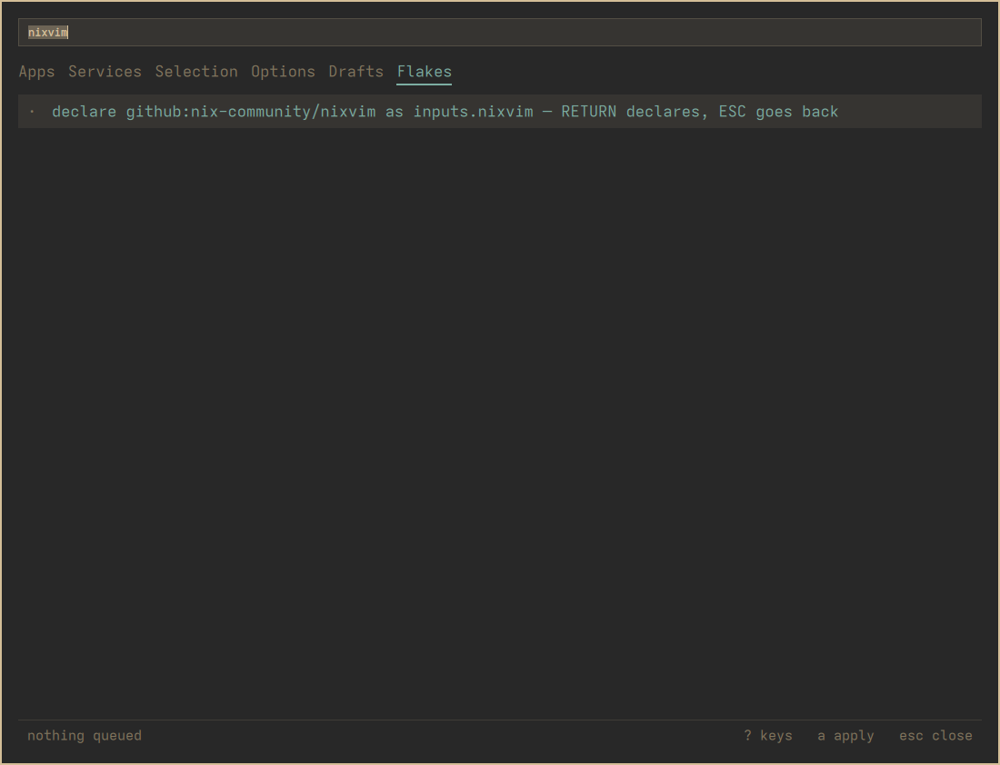

A menu for the thing NixOS is good at and awkward about: **changing what is
installed**. Search nixpkgs, switch apps and services on, set options from a
form, and rebuild when you are ready. What you get is a NixOS generation, so
it rolls back.

<video controls autoplay loop muted playsinline preload="metadata"
       poster="img/tour-poster.png" width="620" height="474"
       aria-label="A tour of the menu: every tab, a search of nixpkgs, a package queued, and a flake's modules listed">
  <source src="img/tour.webm" type="video/webm">
  <!-- A link, not an : an image here is fetched even when the video
       plays, and the gif is five times the webm. -->
  <a href="img/tour.gif">Watch the tour as a GIF</a>
</video>
<ul class="links">
  <li><a href="https://github.com/olafkfreund/nixarchy-pkg#install">Install</a></li>
  <li><a href="manual/">Read the manual</a></li>
  <li><a href="https://github.com/olafkfreund/nixarchy-pkg">Source</a></li>
</ul>

<h2>Getting lazygit without opening an editor</h2>

I want lazygit. I don't know whether it's in nixpkgs, and I don't want to
open a <code>.nix</code> file to find out. Every screenshot below is the real
menu on a real laptop, driven from the keyboard.

<section class="scene">
  
  

    
1 · Find it

    <h3>Search the whole of nixpkgs</h3>
    
<code>SUPER ALT N</code> opens the menu, <code>/</code> searches.
    On Selection the search covers every package in nixpkgs, ranked so the
    exact name comes first rather than buried under everything that happens
    to contain it.

  

</section>

<section class="scene">
  
  

    
2 · Know what you're adding

    <h3>Flags before you commit to anything</h3>
    
A row says when a package is <code>unfree</code>, when nixpkgs marks
    it <code>broken</code>, and when the curated app list already covers it.
    <code>RETURN</code> adds it. Nothing is built yet: adding writes one
    marked line in a file you own.

  

</section>

<section class="scene">
  
  

    
3 · Set an option

    <h3>A form built from the option's type</h3>
    
The Options tab searches NixOS options. <code>RETURN</code> opens a form
    made from the option's declared type: a toggle for a boolean, a list
    editor for a list, its own example to edit when the type has no
    one-word answer. An option you have already set opens on its value.

  

</section>

<section class="scene">
  
  

    
4 · See what's waiting

    <h3>Queued, not installed</h3>
    
The footer and the bar count what differs between your selection and
    what the system was last built from. It's worked out from the files
    each time rather than remembered, so an edit you make by hand in an editor
    shows up here too.

  

</section>

<section class="scene">
  
  

    
5 · Apply, asked twice

    <h3>One key, then the same key again</h3>
    
<code>a</code> says what's about to happen and waits, because this
    rebuilds the whole system. A second <code>a</code> starts it, and any
    other key cancels. The build log streams into the menu as plain text,
    and its last line is the result.

  

</section>

<section class="scene scene--text">
  

    
6 · Change your mind

    <h3>It's a generation</h3>
    
What comes out is an ordinary NixOS generation. If you don't like it,
    boot the previous one or run <code>nixarchy rollback</code>. Nothing
    here replaces NixOS's own safety net. <a href="manual/applying">More on
    applying →</a>

  

</section>

<h2>Everything else</h2>

The rest of the menu, one tab at a time.

  <figure>
    
    <figcaption>Apps: the curated catalogue, on and off.</figcaption>
  </figure>
  <figure>
    
    <figcaption>Services, with what each one actually does.</figcaption>
  </figure>
  <figure>
    
    <figcaption><code>/</code> filters what's already listed.</figcaption>
  </figure>
  <figure>
    
    <figcaption>Flakes: what a flake offers, before you add it.</figcaption>
  </figure>
  <figure>
    
    <figcaption>The input is named from the repo, and you confirm it.</figcaption>
  </figure>
  <figure>
    
    <figcaption>Every NixOS option, searchable.</figcaption>
  </figure>

<h2>What it writes</h2>

It writes nothing you can't read: every change is one marked line in a file
you own, and every write goes through a script
[nixarchy](https://olafkfreund.github.io/nixarchy/manual/) already ships.

It manages a *selection* rather than your machine, which is the one thing
worth knowing before you start: [why that is, and what it
buys you](manual/how-it-works).

<footer class="home-foot">
  <a href="https://github.com/olafkfreund/nixarchy-pkg">Source</a> ·
  <a href="manual/">Manual</a> ·
  <a href="https://olafkfreund.github.io/nixarchy/manual/">nixarchy's manual</a>
</footer>
