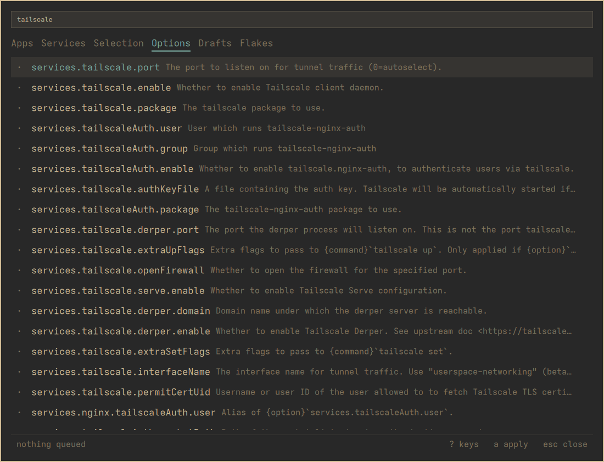
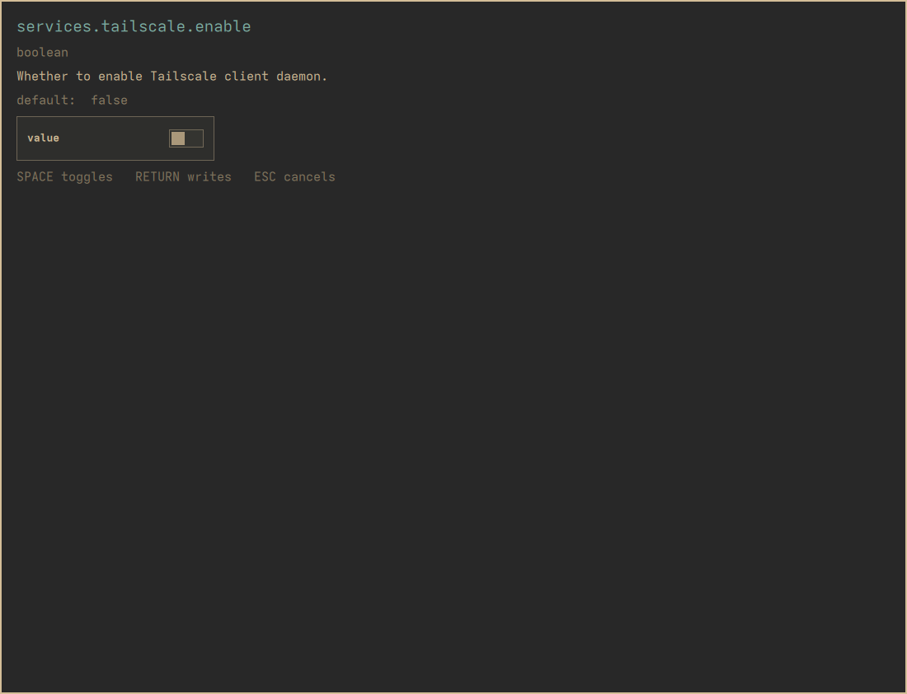
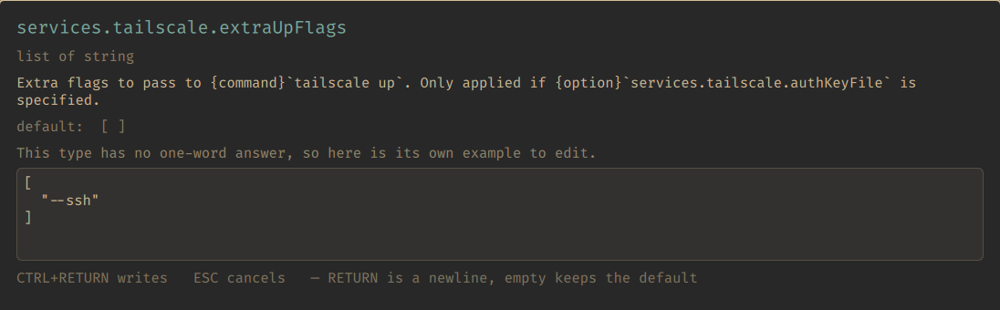

# NixOS options

Every NixOS option there is — about 25,500 of them, including over 2,000
`services.*.enable`. This is how you reach a service the curated catalogue
does not carry, which is most of them.

`/` searches. Each row shows the option's path and its type, read from
nixpkgs' own `options.json` rather than guessed.

## Setting one

`RETURN` opens a form built from the option's declared type. Not a text box
with a label — an actual widget, when the type admits one.

| Type | What you get |
| --- | --- |
| `boolean` | A checkbox. `SPACE` flips it |
| enum | The alternatives, `j`/`k` to choose |
| `int` | A number field |
| simple string / path | A text field |
| anything else | See below |

The type, the documentation and the default are all shown. `RETURN` writes,
`ESCAPE` cancels.

## An untouched field writes nothing

This is the rule worth internalising, and it is deliberate.

The value the form shows you is the **default**. If you leave it alone and
press `RETURN`, nothing is written — because the default is already in force,
and a copied-out default is a line that *reads* like a decision and is not
one. Six months later you cannot tell which of your option lines you meant
and which the form put there.

So: change it, or cancel. Both are honest. Writing out what was already true
is not.

## Why some options get a comment instead of a widget

Booleans, enums, integers and simple strings get a real widget. Lists,
`null or T`, attribute sets, submodules and functions do not.

They get the option's own example — or its default — written **commented
out**, with its type and documentation beside it, as a starting shape for you
to edit.

That is not the form giving up. A widget for "a list of submodules" would be
a text box pretending to understand Nix, and the first thing it would do is
let you write something that parses and means the wrong thing. An honest
scaffold with the real example in it gets you further than a dishonest
widget.

The writer runs a parse check either way, so a value that would leave the
file unparseable is refused and nothing is changed — and the message you get
is nix's own words rather than a guess at them.

## Removing one

`RETURN` on an option row that is already set removes it. The option reverts
to its default, which is what it was before you touched it.
