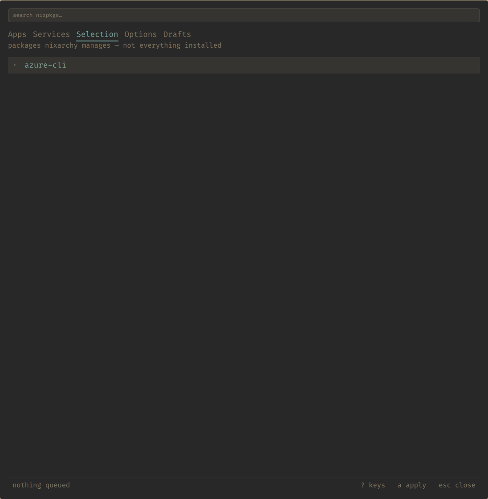
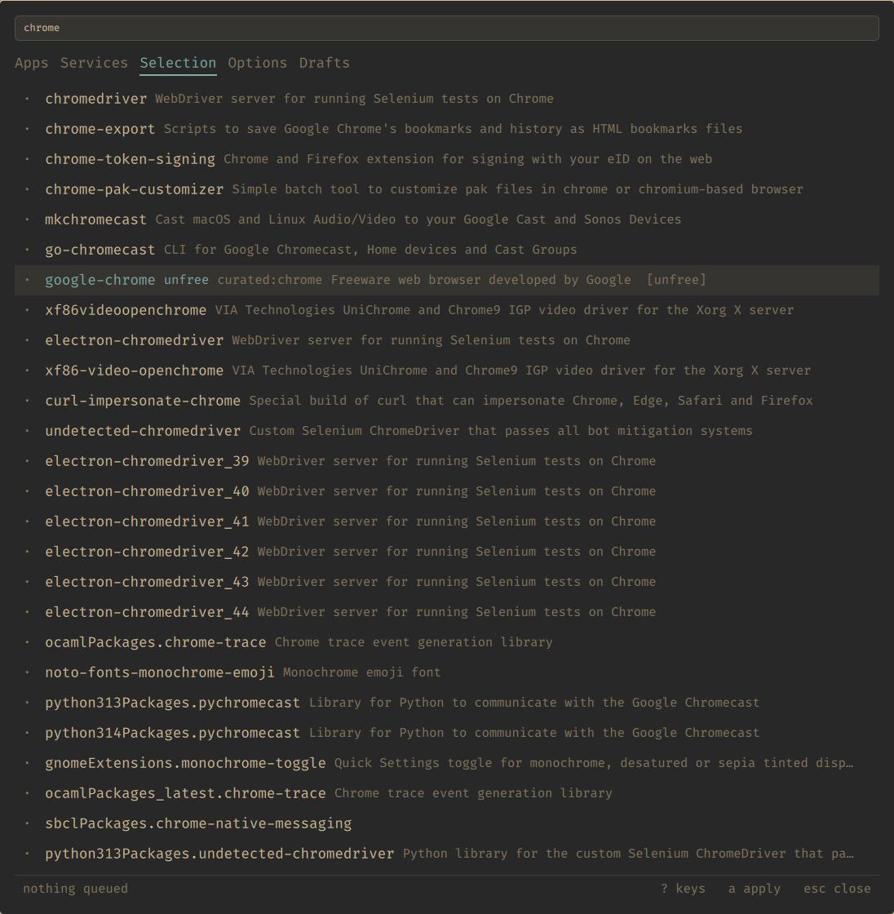

# Packages

The third tab is called **Selection**, and the name is load-bearing. Read the
next two paragraphs even if you skip the rest of this page.

## It lists a selection, not your machine

This tab shows the packages **nixarchy manages for you**. It does not show
what is installed on the machine.

If you already had a NixOS configuration before you met nixarchy — most
people did — the packages you declare in your own modules are not here, are
not managed here, and cannot be removed here. One real machine has 965
packages in `environment.systemPackages` across 128 files, and one of them in
this list.

That is not a bug and it is not going to be fixed by making the list longer.
It is the boundary that makes nixarchy removable: the whole selection hangs
off a single import, and taking that import out takes everything with it and
leaves nothing behind. [How it works](how-it-works) is the full argument.

The practical consequence, which is the part that bites: **removing a package
here removes it from the selection, and if you also declare it somewhere else
it stays installed.** The panel is telling the truth when it says it removed
something. It removed it from the selection.

## Adding one

`/`, then type. This searches the whole nixpkgs index — about 113,000
packages as of writing — not the catalogue.

Results are ranked by *where* the query landed: exact name, then prefix, then
anywhere in the name, then the description. A plain substring match over a
hundred thousand packages buries the obvious answer — searching `git` should
not open on something whose description happens to mention it.

`RETURN` adds the row under the cursor. One line, in
`~/.config/nixarchy/apps.nix`, and nothing is built until you apply.

## The flags

Three things a row can be marked with, all shown before anything is queued:

**`unfree`** — the package has a licence that is not free. Whether that
matters depends on your machine's policy. If `allowUnfree` is on, which is
the default, it installs. If somebody deliberately turned it off, the writer
will add a *commented* `allowUnfreePredicate` naming just that package, for
you to uncomment — a narrow grant rather than advice to flip the global
switch. Read the message line after you add one.

**`broken`** — nixpkgs itself marks this as not building. You can still add
it. It will still not build.

**`curated: <name>`** — the app catalogue already covers this name. Worth
heeding: the app row gets you the NixOS module with its policies and
defaults, and the bare package gets you a binary. Same software, different
amount of it.

### A flag you do not see is not a "no"

If the search index is stale, it carries **no flags at all**, and every
package reads as free. The panel says **index stale — R to rebuild** when
that is the case, and it means it. `R` rebuilds the index; it takes about a
minute.

Absence of a flag is absence of evidence, not evidence of absence.

## The other channel

`SHIFT+RETURN` on a search row adds it from the channel your machine is
*not* on — the stable/unstable escape, per package.

This is a real decision rather than a preference. The two channels share
**no store paths**, even at the same version, so a package taken this way
brings its own entire closure. `nixarchy doctor` measures the cost: btop at
the same version is 0 shared paths and 51 MB duplicated; vlc is 1.5 GB.

So the key asks twice. The first press tells you which channel it would come
from and what it will cost; the second does it. Anything else you press
cancels.

It also tells you that `unfree` and `broken` are **not known** for that
channel, and that is exact rather than cautious: the flags on the row
describe the package on the channel you are *on*, which is a different build
of it. There is no evidence for the other one without fetching it, so the
panel says so rather than showing you a flag about the wrong thing.

Two things it will not do:

- It will not offer the channel you are already on. Asking for that is a
  second copy of a channel you have, sharing nothing with the first, and the
  writer refuses it outright.
- It will not **move** a package between channels. A package already in the
  selection counts as present whichever channel it came from, so re-adding
  does nothing. Remove it, then add it the other way.

## Removing one

`RETURN` on a row that is already in the selection. The marked line is
deleted — exactly the line that was written, wherever you have since moved it
to in the file.

And see the top of this page: that removes it from the selection. If the
package is also declared in your own configuration, it stays.
