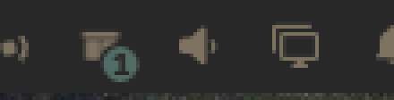

# The bar widget

A parcel and a number, in your bar.

## What the number is

How many changes are waiting for the next rebuild.

That is the whole feature, and it exists because of a gap NixOS has and
package managers do not. On Arch, `pacman -S ripgrep` finishes and ripgrep is
there; there is no in-between state to forget about. Here, picking a row
edits a file and builds nothing. If you pick five things and get distracted,
the machine is unchanged and nothing on screen says so — until the next time
you happen to run an apply and find five surprises in it.

So the count sits in the bar. It is a reminder, and a way back into the list
that made it.

## What it does not do

It does not open a second copy of the menu. Clicking it summons the same
menu, with the same keys, on the same card.

That is a deliberate restraint. A bar dropdown listing the queued changes
would be a second interaction model to keep in step with the first, and the
two would drift — one of them would learn about a new row type and the other
would not. One list, two ways in.

## When it is empty

It shows nothing. An empty queue is not news.

## "never applied"

If the count is drawn beside **never applied**, this machine has a selection
but has never run `nixarchy-apply` — so the copy of your selection that the
flake actually reads does not exist yet. The first apply creates it.

That is normal on a machine that has just installed the plugin, and it means
what it says: what you can see in the menu is not yet what the system is
built from.
