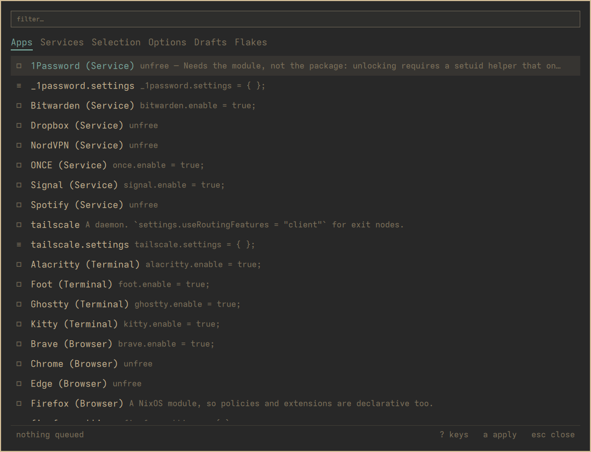

# The menu

One card, five tabs, a list, and two lines at the bottom. Everything in this
manual happens on this surface, so it is worth thirty seconds.

## The tabs

`h` and `l`, or `←` and `→`, or `TAB`. They are positional, so learning
"Selection is the third one" survives a rename.

| Tab | What it lists |
| --- | --- |
| **Apps** | The curated catalogue — things nixarchy knows how to install properly |
| **Services** | The same, for daemons |
| **Selection** | The packages nixarchy manages for you, and `/` searches all of nixpkgs |
| **Options** | Every NixOS option there is |
| **Drafts** | Software nixpkgs does not carry |

## The list

`j`/`k` or `↑`/`↓`. `PAGE UP`/`PAGE DOWN` for ten at a time, `HOME` for the
top.

The box at the left of each row is the state, and it has three values rather
than two:

| | |
| --- | --- |
| `■` | on |
| `□` | off |
| `·` | not a thing with two states — a package, a draft, a search result |
| `≡` | a `.settings` attrset, which *configures* an app rather than being one |

That last one catches people. `firefox` is an app you turn on;
`firefox.settings` is the attrset that configures it. Pressing `SPACE` on it
would ask a writer to enable something that is not an app, so the panel
answers the question itself instead of letting the writer refuse.

## Finding things

`/` focuses the search box. What it does depends on the tab, and the
placeholder says which:

- On **Apps** and **Services** it *filters what is already listed*. The
  catalogue is a few dozen rows and you can see all of them, so filtering
  keeps the on/off state that a search result would not carry.
- On **Selection** and **Options** it *searches the whole index* — about
  113,000 packages and 25,000 options. That is a different operation, and it
  replaces the list rather than narrowing it.

`ESCAPE` steps back one thing at a time: first it clears the search, then it
closes the menu. It does not do both at once, because doing both loses a
query you just typed.

## The two lines at the bottom

The left one is the queue: **nothing queued**, or **3 changes queued**, and
**· never applied** if this machine has not run an apply yet.

Above it, when there is something to say, is whatever the writer last told
you. That is where a refusal appears — an unfree package under a policy that
forbids it, a name nixpkgs does not carry, a licence comment that was
scaffolded for you. It is worth reading; it is the only place the machine
answers back.

## The keys

`?` shows every key, read from `bin/nixarchy-pkg-keys` — the same script the
Learn menu row runs, so there is one list rather than two that drift apart.

This manual deliberately does not reprint that list. It explains what the
keys are *for*; the sheet is on screen at the moment you want to know which
one.
